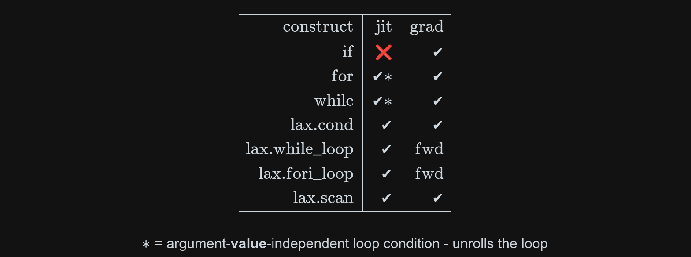
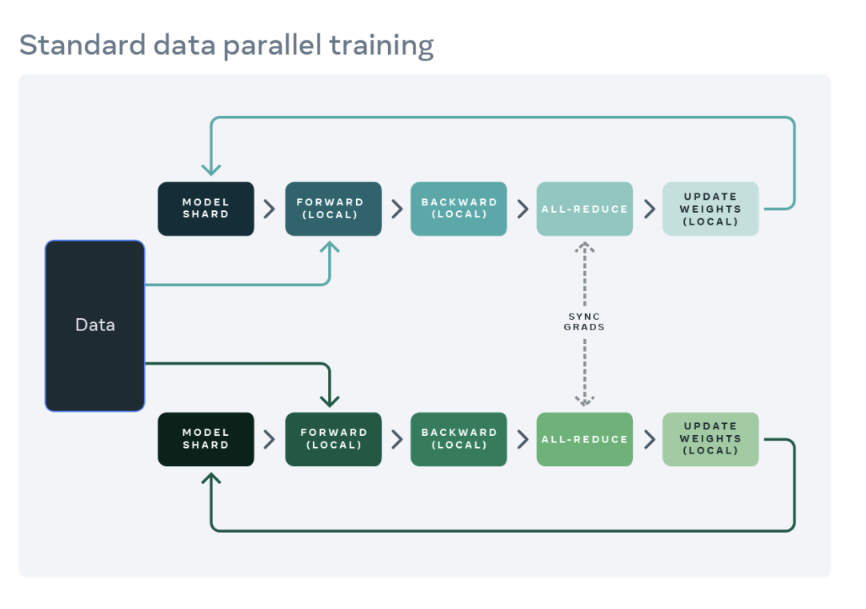
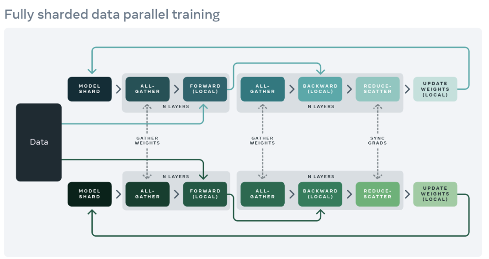
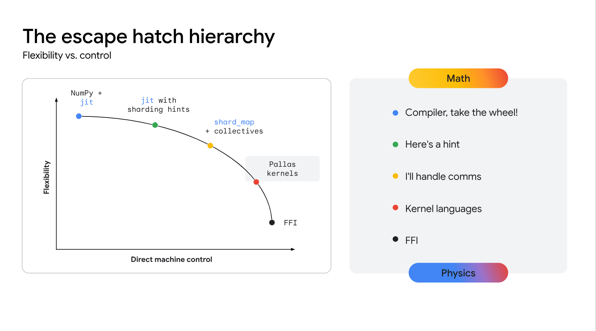
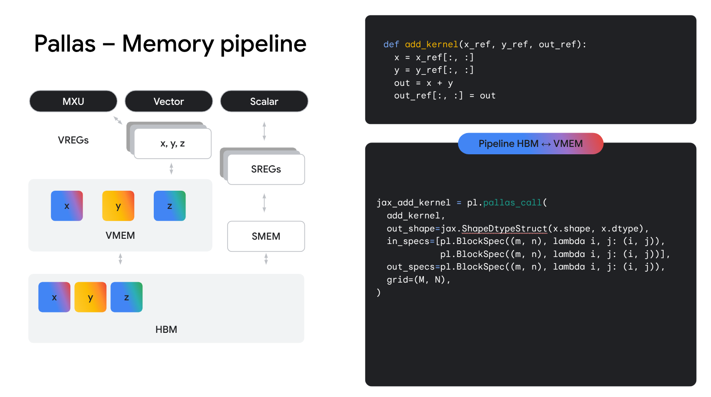

---
jupyter:
  jupytext:
    text_representation:
      extension: .md
      format_name: markdown
      format_version: '1.3'
      jupytext_version: 1.17.3
  kernelspec:
    display_name: venv
    language: python
    name: python3
---

```python
!pip install -U pip uv
!uv pip install -U matplotlib numpy ipympl
!uv pip install -U "jax[tpu]" xprof optax flax torchvision torch --index-url https://download.pytorch.org/whl/cpu

#%load_ext matplotlib
#%matplotlib widget
```

```python
import os
from functools import partial
from pathlib import Path
import contextlib
from pprint import pprint

# no GPU VRAM preallocation can hurt efficiency, but lets us observe VRAM usage
os.environ["XLA_PYTHON_CLIENT_PREALLOCATE"] = "false"  

import jax
from jax import numpy as jnp
from jax import random
from jax.sharding import PartitionSpec as P, NamedSharding
import optax
from tqdm import tqdm

import matplotlib.pyplot as plt
import numpy as np
```

# What is JAX

```python
def add(a, b):
  return a + jnp.sin(b)

add(jnp.ones(1), 2 * jnp.ones(1))  # like numpy
```

# How JAX transformations work

```python
def linear_model(A, x, y):
  return jnp.mean((jnp.tanh(x @ A) - y) ** 2)
```

```python
keys = iter(random.split(jax.random.key(17), 1024))
x = random.normal(next(keys), (1024,))
A = random.normal(next(keys), (1024, 16)) / 1024
y = random.normal(next(keys), (16,))
print("First time call will likely compile the individual numpy ops (what they are lowered to).")
%time linear_model(A, x, y).block_until_ready()
print("Second call will be faster.")
%time linear_model(A, x, y).block_until_ready()
print(linear_model(A, x, y))
```

```python
%timeit -n 100 -r 10 linear_model(A, x, y).block_until_ready()
# first time call will complain about high variance in timing, first call compiles the function
# rerun the cell
%timeit -n 100 -r 10 jax.jit(linear_model)(A, x, y).block_until_ready()
```

```python
jit_fn = jax.jit(linear_model)
%time jax.block_until_ready(jit_fn(A, x, y))
# or simply
jax.jit(linear_model)(A, x, y)  # this jit is cached
```

```python
dA = jax.grad(linear_model)(A, x, y)
dx, dy = jax.grad(linear_model, argnums=(1, 2))(A, x, y)  # provide argnums to get grad wrt non-0 argument
```

```python
jax.jit(jax.hessian(linear_model, argnums=2))(A, x, y)  # higher order derivatives very fast with JIT
```

```python
# jaxpr are unoptimized jax programs intermediate representation
print(jax.make_jaxpr(lambda x: x ** 2)(1))
print("-------------------------------------")
# grad is just a transformation of the program
print(jax.make_jaxpr(jax.grad(lambda x: x ** 2))(1.0))
```

```python
# you can also print the compiled program (this will be hardware specific)
print(jax.jit(jax.grad(lambda x: x ** 2)).lower(1.0).compile().as_text())
```

```python
X = jax.random.normal(next(keys), (128, 1024))
Y = jax.random.normal(next(keys), (128, 16))
```

```python
# in_axes=(
#   None,   # broadcast first argument
#   0,      # batch over the first axis
#   0       # batch over the first axis
# )
jax.vmap(linear_model, in_axes=(None, 0, 0))(A, X, Y).shape
# 128 losses
```

### Working with pytrees

JAX uses pytrees to map over arbitrarily nested containers.

* `jax.tree.map` - applies a transformation to data
* `jax.tree.leaves` - flattens all data into a list
* `jax.tree.structure` - gives you the pytree structure without data
* `jax.tree.flatten` - outputs a tuple of struct and flat list of leaves
* `jax.tree.unflatten` - combines a pytree structure and a flat list of leaves

Most functions accept pytrees!

```python
model = {
    "layer_embed": jnp.ones((2, 2)),
    "layers": [1, 2, 3, jnp.ones(2)],
    "names": ["model", ("alternative", "names")]
}

model
```

```python
[type(x) for x in jax.tree.leaves(model)]
```

```python
jax.tree.structure(model)
```

```python
jax.tree.map(lambda x: None, model)
```

# Neural Networks with NNX


| Framework   | Origin      | Key Characteristics             | Status / Notes                                   |
|-------------|-------------|---------------------------------|--------------------------------------------------|
| ~~haiku~~       | from GDM    | Early JAX NN library            | **Deprecated**                                   |
| equinox     | third party | Simple and powerful stateful/functional library | Has a lot of fans, treat all models and modules as pytrees  |
| flax.linen  | from GDM    | Original `flax` interface | In active use, useful for some applications      |
| **flax.nnx (highly recommended)**   | from GDM    | New stateful `flax` interface     | Supports model surgery, **Recommended for new projects**, Stateful modules similar to PyTorch |

```python
from flax import nnx

class Model(nnx.Module):
  def __init__(self, *, rngs: nnx.Rngs):
    self.embed = nnx.Linear(1, 128, rngs=rngs)
    self.ws = nnx.data([nnx.Linear(128, 128, rngs=rngs) for _ in range(16)])
    self.out_project = nnx.Linear(128, 1, rngs=rngs)
    
  def __call__(self, x):
    z = jax.nn.relu(self.embed(x))
    for w in self.ws:
      z = jax.nn.relu(w(z))
    return self.out_project(z)
```

```python
rngs = nnx.Rngs(0)  # we need a random key generator for deterministic randomness
model = Model(rngs=nnx.Rngs(0))  # model initialized like a Python class (it is a Python object)
graphdef, state = nnx.split(model)  # split the model into its (graph) definition and its JAX state
```

```python
# you can modify model in place, perform surgery
print(model.embed.kernel[...])  # NNX values are references to jax.Array
model.embed.kernel[...] *= 2
print(model.embed.kernel[...])

# need to split into state again
graphdef, state = nnx.split(model)
# or just get the state
state = nnx.state(model)
```

```python
model_size = jax.tree.reduce(         # reduce to add all byte sizes
  lambda x, y: x + y,
  jax.tree.map(                       #  map to get byte size of each leaf
    lambda x: x.itemsize * x.size,
    state)
)
print(f"Model size = {model_size / 1e6} MB")
```

```python
# state is a pytree
state
```

```python
# graphdef is the model skeleton
graphdef
```

```python
@jax.jit
def forward(state, x):
  model = nnx.merge(graphdef, state) # merge the model graph and the model state
  return model(x)
  
@jax.jit
def loss_fn(state, x, y):
  yp = forward(state, x)
  return jnp.mean(jnp.linalg.norm(y - yp, axis=-1) ** 2)

grad_fn = jax.jit(jax.grad(loss_fn, argnums=0))
```

```python
# synthetic data with most points concentrated in the middle

X = 3e0 * random.normal(rngs(), (1024, 1))
Y = jnp.cos(X) + 1e-1 * random.normal(rngs(), X.shape)

plt.figure()
plt.scatter(X[..., 0], Y[..., 0], marker=".")
Yp = forward(state, X)
plt.scatter(X[..., 0], Yp[..., 0], marker=".")
```

```python
optimizer = optax.adam(1e-5)

@jax.jit # want to compile the top level function
def train_step(x, y, state, opt_state):
  loss = loss_fn(state, x, y)
  gs = jax.grad(loss_fn, argnums=0)(state, x, y) # recomputation, but ok, compiler will merge it
  updates, opt_state = optimizer.update(gs, opt_state)
  new_state = optax.apply_updates(state, updates)
  return loss, new_state, opt_state

state = nnx.state(model)
opt_state = optimizer.init(state)

pbar = tqdm(range(int(4e3)))
for _ in pbar:
  ridx = random.randint(rngs(), (64,), 0, X.shape[0])
  x, y = X[ridx, :], Y[ridx, :]
  l, state, opt_state = train_step(x, y, state, opt_state)
  pbar.set_description(f"loss = {l:.4e}")
```

```python
X_sort = jnp.sort(X, axis=0)
Yp_sort = forward(state, X_sort)
plt.figure()
plt.plot(X_sort[:, 0], Yp_sort[:, 0], color="red")
plt.scatter(X[:, 0], Y[:, 0], marker=".")
```

```python
# static argnuments are non-numeric or for Python control flow
# must be declared explicitly because JAX is trying to compile as much as possible
@partial(jax.jit, static_argnames=("loss_fn",)) 
def train_step(x, y, state, opt_state, loss_fn=None):
  loss = loss_fn(state, x, y)
  gs = jax.grad(loss_fn, argnums=0)(state, x, y) # recomputation, but ok, compiler will merge it
  updates, opt_state = optimizer.update(gs, opt_state)
  new_state = optax.apply_updates(state, updates)
  return loss, new_state, opt_state
```

```python
@jax.jit
def weighted_loss_fn(state, x, y):
  yp = forward(state, x)
  per_example_loss = jnp.sum((y - yp) ** 2, axis=-1)
  return jnp.mean(1e1 * jnp.abs(x[..., 0]) * per_example_loss) # weigh examples farther from zero more

pbar = tqdm(range(int(4e3)))
for _ in pbar:
  ridx = random.randint(rngs(), (64,), 0, X.shape[0])
  x, y = X[ridx, :], Y[ridx, :]
  l, state, opt_state = train_step(x, y, state, opt_state, loss_fn=weighted_loss_fn)
  pbar.set_description(f"loss = {l:.4e}")
```

```python
X_sort = jnp.sort(X, axis=0)
Yp_sort = forward(state, X_sort)
plt.figure()
plt.plot(X_sort[:, 0], Yp_sort[:, 0], color="red")
plt.scatter(X[:, 0], Y[:, 0], marker=".")
```

# Robotics + RL

### Loop unrolling and JAX control flow

```python
# calling train step from eager mode can have a small overhead (~1-5 ms on GPUs, less on other platforms)

# we can unroll the training loop
@partial(jax.jit, static_argnames=("steps", "loss_fn",))
def train_n_steps(x, y, state, opt_state, steps, loss_fn=None):
  # steps is a static variable

  loss_history = []
  for i in range(steps):  # unroll the loop inside the jitted function
    x_, y_ = x[i, ...], y[i, ...]
    loss, state, opt_state = train_step(x_, y_, state, opt_state, loss_fn=loss_fn)
    loss_history.append(loss)

  return jnp.stack(loss_history), state, opt_state
```

```python
state = nnx.state(Model(rngs=rngs))
opt_state = optimizer.init(state)

pbar = tqdm(range(int(4000 // 64)))
steps = 64
for _ in pbar:
  ridx = random.randint(rngs(), (steps * 64,), 0, X.shape[0])
  x, y = X[ridx, :], Y[ridx, :]
  x, y = x.reshape((steps, 64, 1)), y.reshape((steps, 64, 1))
  # l, state, opt_state = train_n_steps(x, y, state, opt_state, steps=steps, loss_fn=loss_fn)
  l, state, opt_state = train_n_steps(x, y, state, opt_state, steps=steps, loss_fn=loss_fn)
  pbar.set_description(f"losses = {l[-1]:.4e}")
  
  # each iteration is actually 3 iterations
```

```python
X_sort = jnp.sort(X, axis=0)
Yp_sort = forward(state, X_sort)
plt.figure()
plt.plot(X_sort[:, 0], Yp_sort[:, 0], color="red")
plt.scatter(X[:, 0], Y[:, 0], marker=".")
```

```python
# we can unroll the training loop
@partial(jax.jit, static_argnames=("loss_fn",))
def train_n_steps(x, y, state, opt_state, steps, loss_fn=None):
  # steps no longer needs to be a static variable

  def loop_body(i, carry):
    loss_history, state, opt_state = carry
    x_ = jax.lax.dynamic_index_in_dim(x, i, axis=0)  # single batch from a stack of batches
    y_ = jax.lax.dynamic_index_in_dim(y, i, axis=0)  # single batch from a stack of batches
    loss, state, opt_state = train_step(x_, y_, state, opt_state, loss_fn=loss_fn)
    loss_history = jax.lax.dynamic_update_index_in_dim(loss_history, loss, i, axis=0)
    return loss_history, state, opt_state
    
  loss_history = jnp.zeros((1024,))  # overallocate
  loss_history, state, opt_state = jax.lax.fori_loop(0, steps, loop_body, (loss_history, state, opt_state))
  return loss_history, state, opt_state
```

```python
state = nnx.state(Model(rngs=rngs))
opt_state = optimizer.init(state)

pbar = tqdm(range(int(50)))
steps = 100
for _ in pbar:
  ridx = random.randint(rngs(), (steps * 64,), 0, X.shape[0])
  x, y = X[ridx, :], Y[ridx, :]
  x, y = x.reshape((steps, 64, 1)), y.reshape((steps, 64, 1))
  l, state, opt_state = train_n_steps(x, y, state, opt_state, steps=steps, loss_fn=loss_fn)
  pbar.set_description(f"losses = {l[-1]:.4e}")
  
  # each iteration is actually 100 iterations
```

### What about a dynamic iteration count?

```python
# train for n steps or until you encounter a nan loss

@partial(jax.jit, static_argnames=("loss_fn",))
def train_n_steps_maybe_stop_early(x, y, state, opt_state, steps, loss_fn=None):
  # steps no longer needs to be a static variable

  def loop_body(i, carry):
    loss_history, state, opt_state, done = carry
    x_ = jax.lax.dynamic_index_in_dim(x, i, axis=0)
    y_ = jax.lax.dynamic_index_in_dim(y, i, axis=0)
    loss, state, opt_state = train_step(x_, y_, state, opt_state, loss_fn=loss_fn)
    loss_history = jax.lax.dynamic_update_index_in_dim(loss_history, loss, i, axis=0)

    done = done | jnp.isnan(loss)  # update the done state

    return loss_history, state, opt_state, done

  def lazy_loop_body(i, carry):
    done = carry[-1]
    new_carry = jax.lax.cond(done, 
                             lambda: carry,
                             lambda: loop_body(i, carry))
    return new_carry

  loss_history = jnp.zeros((1024,))  # cannot use steps, need to overallocate
  done = False
  init_val = (loss_history, state, opt_state, done)
  steps = (2 ** jnp.ceil(jnp.log2(steps))).astype(jnp.int32)  # just for fun, use an even power of 2 iterations
  loss_history, state, opt_state, done = jax.lax.fori_loop(0, steps, lazy_loop_body, init_val)
  return loss_history, state, opt_state
```

```python
state = nnx.state(Model(rngs=rngs))
opt_state = optimizer.init(state)

pbar = tqdm(range(int(50)))
steps = 100
for _ in pbar:
  ridx = random.randint(rngs(), (steps * 64,), 0, X.shape[0])
  x, y = X[ridx, :], Y[ridx, :]
  x, y = x.reshape((steps, 64, 1)), y.reshape((steps, 64, 1))
  l, state, opt_state = train_n_steps_maybe_stop_early(x, y, state, opt_state, steps=steps, loss_fn=loss_fn)
  pbar.set_description(f"losses = {l[-1]:.4e}")
```

### JAX control flow

### [https://docs.jax.dev/en/latest/control-flow.html](https://docs.jax.dev/en/latest/control-flow.html)


<!---->


# Train on actual data

```python
from torchvision import datasets
from torch.utils.data import DataLoader  # use torch dataloader to set up data

def collate_fn(data):
  return np.stack([arg[0] for arg in data]), np.array([arg[1] for arg in data])

ds = datasets.MNIST(".", download=True)
dl = DataLoader([(np.array(image), cls) for image, cls in tqdm(ds)], 128, shuffle=True, collate_fn=collate_fn, drop_last=True)
```

```python
class MNISTModel(nnx.Module):
  def __init__(self, *, rngs: nnx.Rngs):
    channels = 128
    self.conv0 = nnx.Conv(1, channels, (3, 3), rngs=rngs)
    self.convs = nnx.data([nnx.Conv(channels, channels, (3, 3), rngs=rngs) for _ in range(32)])
    self.output = nnx.Linear(channels * 28 * 28, 1024, rngs=rngs)
    self.classifier = nnx.Linear(1024, 10, rngs=rngs)
    
  def __call__(self, x):
    x = x if x.ndim == 4 else x[..., None]
    z = jax.nn.relu(self.conv0(x))
    for conv in self.convs:
      z = z + jax.nn.relu(conv(z))
    z = z.reshape((z.shape[0], -1))
    self.sow(nnx.Intermediate, "x_flat", z)  # if you want to save some values
    z = jax.nn.relu(self.output(z))
    return self.classifier(z)
```

```python
rngs = nnx.Rngs(0)  # create random keys generator
model = MNISTModel(rngs=rngs)
```

```python
# get intermediate value by filtering out intermediate state
# nnx.split and nnx.state take additional filter arguments
# these filter out variable types
# - nnx.Param
# - nnx.BatchStat
# - nnx.Intermediate

imgs, classes = next(iter(dl))
_ = model(imgs)
x_flat = nnx.state(model, nnx.Intermediate).x_flat[0]  # filter out only nnx.Intermediate variables
print(x_flat.shape)
```

```python
model = MNISTModel(rngs=rngs)
graphdef, state = nnx.split(model)
jax.sharding.set_mesh(jax.make_mesh((1,), ("data",)))
state = jax.device_put(state, P())
optimizer = optax.adam(1e-4)
opt_state = optimizer.init(state)

@jax.jit
def train_step(imgs, y, state, opt_state):

  def loss_fn(state):
    model = nnx.merge(graphdef, state)
    yp = model(imgs)
    return jnp.mean(optax.softmax_cross_entropy_with_integer_labels(yp, y))
    
  with jax.named_scope("forward"):
    loss = loss_fn(state)
  with jax.named_scope("backward"):
    gs = jax.grad(loss_fn)(state)
  pred = nnx.merge(graphdef, state)(imgs)
  updates, opt_state = optimizer.update(gs, opt_state)
  state = optax.apply_updates(state, updates)
  return loss, pred, state, opt_state
```

```python
losses = []
max_it = int(2e2)
pbar = tqdm(enumerate(dl), total=max_it)
total, correct = 0, 0
train_accuracies = []
_ = train_step(imgs, classes, state, opt_state) # precompile train step
for i, (imgs, classes) in pbar:
  loss, pred, state, opt_state = train_step(imgs, classes, state, opt_state)
  losses.append(loss)
  total, correct = total + imgs.shape[0], correct + jnp.sum(jnp.argmax(pred, -1) == classes)
  train_accuracies.append(correct / total)
  pbar.set_description(f"{loss = :.4e}, accuracy {correct / total:%}")
  if i > max_it:
    break
model = nnx.merge(graphdef, state)  # merge model to insert the optimized state

plt.figure()
plt.plot(train_accuracies)
plt.ylabel("Accuracy")
plt.xlabel("Iteration")
```

# Profiling and Optimization

```python
!uv pip install xprof
# NOTE: you need to run the actual server via `xprof --logdir /tmp/profiles`
@contextlib.contextmanager
def profile(path="/tmp/profiles", port=8791):
  with jax.profiler.trace("/tmp/profiles"):
    yield
  profiles = sorted(Path(path).absolute().glob("**/*.xplane.pb"), key=lambda x: x.stat().st_mtime)
  profile_name = profiles[-1].parts[-2]
  url = "http://localhost:{port}/data/plugin/profile/trace_viewer@;run={name};tag=trace_viewer@"  # xprof version
  print(url.format(port=port, name=profile_name))
```

```python
model = MNISTModel(rngs=rngs)
graphdef, state = nnx.split(model)
optimizer = optax.adam(1e-3)
opt_state = optimizer.init(state)
#with jax.profiler.trace(Path("~/profiles").expanduser()):
with profile():
  for _ in range(10):
    loss, pred, state, opt_state = train_step(imgs, classes, state, opt_state)
  jax.block_until_ready(loss)
    
# use tensorboard from command line or install tensorboard VSCode extension
# profile is at ~/profiles
```

# Unified sharding API (Data / Tensor / Pipeline parallelism)

```python
pprint(jax.devices())
```

```python
from jax.sharding import PartitionSpec as P, set_mesh

# a simple mesh with one axis called "data" - name is completely arbitrary
mesh = jax.make_mesh((jax.device_count(),), ("data",))
with jax.set_mesh(mesh):  # set the mesh globally
  A = jnp.ones((16, 16))
  A = jax.device_put(A, P("data", None))
  # A = jnp.ones((16, 16), out_sharding=P("data", None))  # also works
  jax.debug.visualize_array_sharding(A)
jax.set_mesh(mesh)  # set the mesh globally for later cells
```

```python
A = jax.device_put(A, P("data", "data"))  # cannot shard both axis
```

```python
A = jax.device_put(jnp.ones((3, 4)), P("data", None))  # cannot shard both axis
```

### Data parallel


<!---->


Image: Meta

```python
imgs, classes = next(iter(dl))

imgs = jax.device_put(imgs, P("data", None, None))
classes = jax.device_put(classes, P("data"))
```

```python
# jax.debug.visualize_array_sharding(imgs)  # visualize_array_sharding works for 1D and 2D
imgs.sharding
```

```python
jax.debug.visualize_array_sharding(imgs[..., 0])
jax.debug.visualize_array_sharding(classes)
```

```python
rngs = nnx.Rngs(0)
model = MNISTModel(rngs=rngs)
graphdef, state = nnx.split(model)
optimizer = optax.adam(1e-3)
opt_state = optimizer.init(state)

state = jax.device_put(state, P())  # model is replicate in DP

@jax.jit
def train_step(imgs, y, state, opt_state):

  def loss_fn(state, x, y):
    # with sharding constraints instructs the compiler to shard intermediate value across devices
    # this is a hard sharding constraint - the compiler must obey it
    # the compiler attempts to make optimal decisions about sharding
    x = jax.sharding.reshard(x, P("data", None, None))
    yp = nnx.merge(graphdef, state)(x)
    y, yp = jax.sharding.reshard((y, yp), P("data"))
    # constraint outputs to ensure data parallelism

    return jnp.mean(optax.softmax_cross_entropy_with_integer_labels(yp, y))
    
  with jax.named_scope("forward"):  # for profiling annotations
    loss = loss_fn(state, imgs, y)
  with jax.named_scope("backward"): # for profiling annotations
    gs = jax.grad(loss_fn)(state, imgs, y)
  pred = nnx.merge(graphdef, state)(imgs)
  updates, opt_state = optimizer.update(gs, opt_state)
  state = optax.apply_updates(state, updates)
  return loss, pred, state, opt_state
```

```python
losses = []
max_it = int(2e2)
pbar = tqdm(enumerate(dl), total=max_it)
total, correct = 0, 0
train_accuracies = []
for i, (imgs, classes) in pbar:
  loss, pred, state, opt_state = train_step(imgs, classes, state, opt_state)
  losses.append(loss)
  total, correct = total + imgs.shape[0], correct + jnp.sum(jnp.argmax(pred, -1) == classes)
  train_accuracies.append(correct / total)
  pbar.set_description(f"{loss = :.4e}, accuracy {correct / total:%}")
  if i > max_it:
    break
model = nnx.merge(graphdef, state)  # merge model to insert the optimized state

plt.figure()
plt.plot(train_accuracies)
plt.ylabel("Accuracy")
plt.xlabel("Iteration")
```

```python
# profile to compare single device vs DP

model = MNISTModel(rngs=rngs)
graphdef, state = nnx.split(model)
optimizer = optax.adam(1e-3)
opt_state = optimizer.init(state)

def profile_body():
  global imgs, classes, state, opt_state
  with jax.set_mesh(jax.make_mesh((1,), ("data",))):
    imgs, classes, state, opt_state  = jax.device_put((imgs, classes, state, opt_state), P())  # place mesh devices
    for _ in range(10):
      loss, pred, state, opt_state = train_step(imgs, classes, state, opt_state)
  with jax.set_mesh(jax.make_mesh((jax.device_count(),), ("data",))):
    imgs, classes, state, opt_state  = jax.device_put((imgs, classes, state, opt_state), P())  # place mesh devices
    for _ in range(10):
      loss, pred, state, opt_state = train_step(imgs, classes, state, opt_state)

profile_body()  # precompile to not profile compilation (cleaner profile)
#with jax.profiler.trace(Path("~/profiles").expanduser()):
with profile():
  profile_body()
```

### FSDP


<!---->


Image: Meta

```python
set_mesh(jax.make_mesh((jax.device_count(),), ("fsdp",)))

def shard_weight(x):
  if x.ndim == 2 and x.shape[0] % mesh.devices.shape[0] == 0:
    return jax.device_put(x, P("fsdp", None))
  else:
    return jax.device_put(x, P())
```

```python
rngs = nnx.Rngs(0)
model = MNISTModel(rngs=rngs)
graphdef, state = nnx.split(model)
optimizer = optax.adam(1e-3)
opt_state = optimizer.init(state)

# state = jax.device_put(state, P())  # model is replicate in DP
state = jax.tree.map(shard_weight, nnx.state(model))  # for FSDP

@partial(jax.jit, static_argnames=("axis",))
def train_step(imgs, y, state, opt_state, axis=None):

  def loss_fn(state, x, y):
    #x = jax.lax.with_sharding_constraint(x, P(axis, None))  # shard data according to `axis` name
    x = jax.reshard(x, P(axis, None))  # shard data according to `axis` name
    yp = nnx.merge(graphdef, state)(x)
    y, yp = jax.reshard((y, yp), P(axis))  # shard data according to `axis` name
    return jnp.mean(optax.softmax_cross_entropy_with_integer_labels(yp, y))
    
  with jax.named_scope("forward"):  # for profiling annotations
    loss = loss_fn(state, imgs, y)
  with jax.named_scope("backward"): # for profiling annotations
    gs = jax.grad(loss_fn)(state, imgs, y)
  pred = nnx.merge(graphdef, state)(imgs)
  updates, opt_state = optimizer.update(gs, opt_state)
  state = optax.apply_updates(state, updates)
  return loss, pred, state, opt_state
```

```python
losses = []
max_it = int(2e2)
pbar = tqdm(enumerate(dl), total=max_it)
total, correct = 0, 0
train_accuracies = []
for i, (imgs, classes) in pbar:
  loss, pred, state, opt_state = train_step(imgs, classes, state, opt_state)
  losses.append(loss)
  total, correct = total + imgs.shape[0], correct + jnp.sum(jnp.argmax(pred, -1) == classes)
  train_accuracies.append(correct / total)
  pbar.set_description(f"{loss = :.4e}, accuracy {correct / total:%}")
  if i > max_it:
    break
model = nnx.merge(graphdef, state)  # merge model to insert the optimized state

plt.figure()
plt.plot(train_accuracies)
```

```python
# profile to compare single device vs DP vs FSDP
model = MNISTModel(rngs=rngs)
graphdef, state = nnx.split(model)
optimizer = optax.adam(1e-3)

def profile_body():
  global imgs, classes, state

  with jax.set_mesh(jax.make_mesh((1,), ("data",))):
    imgs, classes, state = jax.device_put((imgs, classes, state), P())  # place mesh devices
    opt_state = optimizer.init(state)
    for _ in range(10):
      loss, pred, state, opt_state = train_step(imgs, classes, state, opt_state, axis=None)
    jax.block_until_ready(loss)
  with jax.set_mesh(jax.make_mesh((4,), ("data",))):
    imgs, classes, state = jax.device_put((imgs, classes, state), P())  # place mesh devices
    opt_state = optimizer.init(state)
    for _ in range(10):
      loss, pred, state, opt_state = train_step(imgs, classes, state, opt_state, axis="data")
    jax.block_until_ready(loss)
  with jax.set_mesh(jax.make_mesh((4,), ("fsdp",))):
    imgs, classes, state = jax.device_put((imgs, classes, state), P())  # place mesh devices
    state = jax.tree.map(shard_weight, state)
    opt_state = optimizer.init(state)
    for _ in range(10):
      loss, pred, state, opt_state = train_step(imgs, classes, state, opt_state, axis="fsdp")
    jax.block_until_ready(loss)

profile_body()  # precompile to not profile compilation (cleaner profile)
with profile():
  profile_body()
  
```

# More useful JAX


### Use multiple CPU devices

```python
import jax
jax.config.update("jax_num_cpu_devices", 8)
print(jax.devices("cpu"))
```

### Eval shape - abstract function evaluation

```python
def enormous_array():
  return random.normal(random.key(0), (1024, 1024, 1024, 1024)) # 4 TB
  
A = jax.eval_shape(enormous_array)
print(A.size / 1e9)
A  # just the shape dtype struct
```

```python
model = nnx.eval_shape(lambda: MNISTModel(rngs=nnx.Rngs(0)))
```

### Ahead of time compilation
### [https://openxla.org/](https://openxla.org/)

```python
@jax.jit
def square(x):
  return x ** 2
  
fn = square.lower(jnp.ones(10)).compile()
print(fn.as_text())
```

```python
# works with abstract values, but XLA will warn you about trying to allocate Petabytes of data
fn = square.lower(jax.ShapeDtypeStruct((2 ** 50,), jnp.float32)).compile()
print(fn.as_text())
```

```python
train_step_compiled = train_step.lower(imgs, classes, state, opt_state, axis=None).compile()
print(f"Train step is {len(train_step_compiled.as_text().split('\n'))} lines of HLO")
```


<!---->


### Explicit Communication: [shard_map](https://docs.jax.dev/en/latest/notebooks/shard_map.html)

```python
from jax import numpy as jnp
from jax.experimental.shard_map import shard_map


@partial(shard_map, mesh=mesh, 
    in_specs=(P('x', 'y'), P('y', None)),
    out_specs=P('x', None))
def matmul_basic(a_block, b_block):
  # a_block: f32[2, 8]
  # b_block: f32[8, 4]

  # compute
  z_partialsum = jnp.dot(a_block, b_block)

  # communicate
  z_block = jax.lax.psum(z_partialsum, 'y')

  # c_block: f32[2, 4]
  return z_block
```

### Kernel languages: Pallas



<!---->


### High-performance LLM inference
### [https://github.com/jax-ml/jax-llm-examples](https://github.com/jax-ml/jax-llm-examples)
